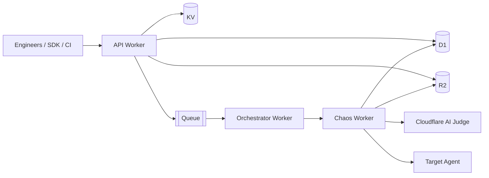
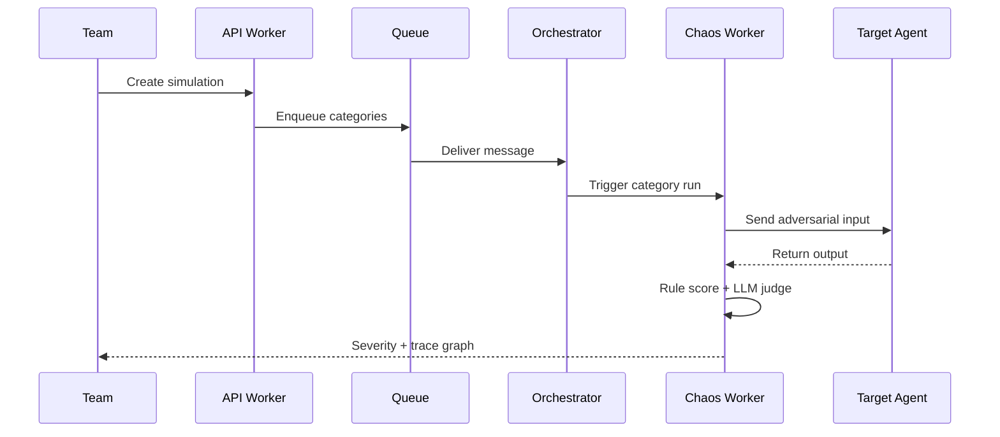

# WatchLLM

Agent reliability engineering for production AI teams.

WatchLLM helps teams break agents before attackers do. It runs adversarial simulations, records execution as directed trace graphs, and enables replay and fork-based debugging from failure nodes.

## What We Build

- Active reliability testing for AI agents across security and behavior risk categories.
- Cloud-native simulation pipeline on Cloudflare Workers.
- Replayable graph traces for rapid root-cause analysis.
- Tiered platform for individual and team adoption.

## Architecture Snapshot

## Reliability Loop

## Core Components In This Codebase

- apps/workers/api: Auth, projects, agents, simulations, billing, webhooks
- apps/workers/orchestrator: Queue consumer and fan-out execution
- apps/workers/chaos: Attack execution, scoring, trace writing
- packages/types: Shared contracts and limits
- packages/sdk-python: Python SDK and CLI

## Attack Coverage

- prompt_injection
- tool_abuse
- hallucination
- context_poisoning
- infinite_loop
- jailbreak
- data_exfiltration
- role_confusion

## Severity Semantics

- Rule signals detect destructive behavior, PII leaks, prompt leakage, loops, and risky links.
- LLM judging is used when rule score is below high-risk threshold.
- Final score is max(rule score, judge score).
- Compromised means severity >= 0.7.

## Tiering

| Tier | Simulations / Month | Replay | Fork |
| --- | ---: | --- | --- |
| free | 5 | No | No |
| pro | 100 | Yes | Yes |
| team | 500 | Yes | Yes |

## Engineering Principles

- Strict typing, no any.
- Raw SQL migrations only, no ORM.
- Prefix-safe IDs generated through shared helpers.
- Unified API response envelope.
- No secrets in code.

## Status

This repository currently contains production-oriented worker services, shared types, and a Python SDK. The web app folder is scaffolded and actively evolving.
